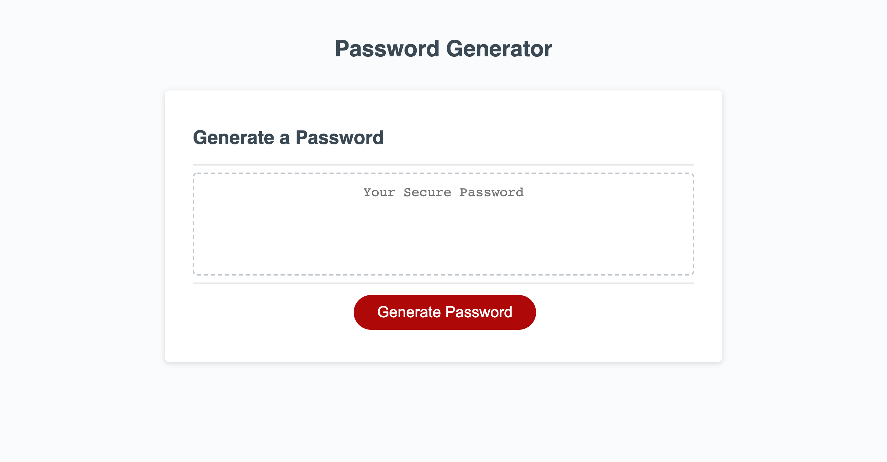

# password_generator

## Homework # 3
 This is an application that an employee can use to generate a random password. This app will run in the browser, and will feature dynamically updated HTML and CSS powered by JavaScript. The password can include special characters. Prompts the user for password criteria, of at least 8 characters and no more than 128 characters, lowercase, uppercase, numeric, and/or special characters.

 

 ## Screenshot of final outcome:

 ## Links:

 link to live website: 
 https://merikettapearl212.github.io/password_generator/

 link to repo: 
 https://github.com/merikettapearl212/password_generator
